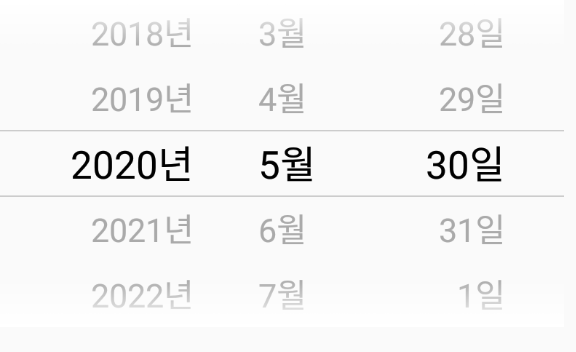

# react-native-auto-picker
- 미리보기 <br>
 <br> <br>
<<<<<<< HEAD
- 미리설치해야할 모듈 <br>
```
npm install --save moment
```
=======
>>>>>>> parent of a9c81c1... ini
- 선언 <br>
```
import DatePicker from 'react-native-auto-picker';
```
- 사용 <br> <br>
```
this.state={
    date : null
};

<DatePicker locale="ko-KR" mode="date" date={new Date()} onDateChange={this.state.date}/>
```
